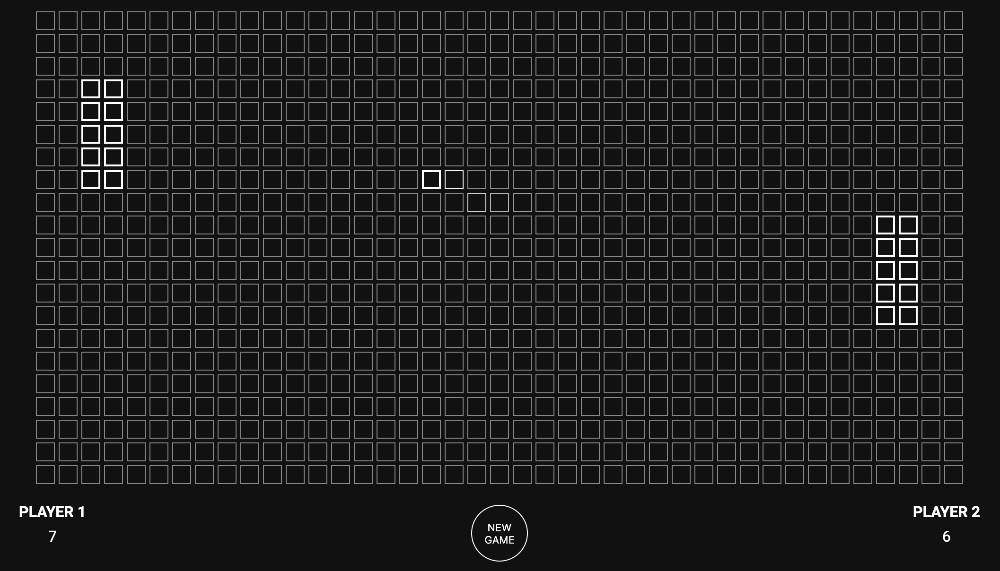

# Socket Pong

This project was, for me, an introduction to Elixir and Phoenix. I wanted to try Phoenix Channels, the high performance of Elixir and the concurrent aspect of Erlang. What's better than an online Pong game to give it a shot ?

You can try it here : https://phoenix-socket-pong.herokuapp.com/, have fun !

**To start Socket Pong:**
  * Install dependencies with `mix deps.get`
  * Create and migrate your database with `mix ecto.setup`
  * Install Node.js dependencies with `cd assets && npm install`
  * Start Phoenix endpoint with `mix phx.server`
  * Then, visit [`localhost:4000`](http://localhost:4000) from your browser.

**The rules:**
  * Every visitor on the page is able to move either player 1 or player 2.
  * Every time a ball the right edge, the player 1 scores.
  * Every time a ball the left edge, the player 2 scores.
  * When you click "NEW GAME", the scores are reset and a new game starts.
  
**The commands:**
  * `W`/`S` to make the player 1 go Up and Down.
  * `↑`/`↓` to make the player 2 go Up and Down.
